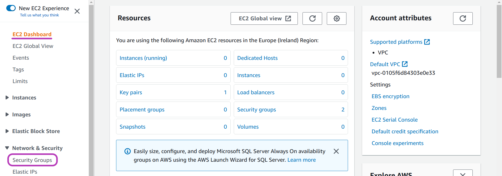
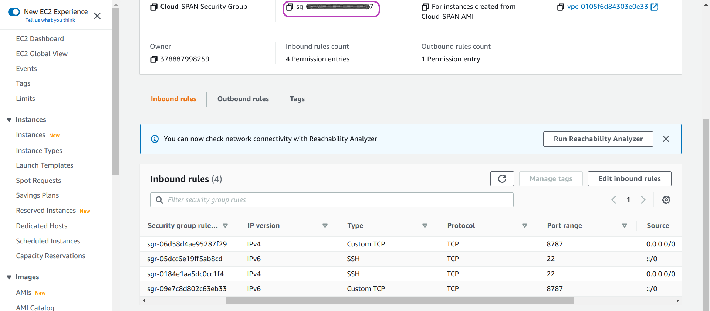

> ## Prerequisites
> **Please read [Workshops Organisation](https://cloud-span.github.io/cloud-admin-guide-0-overview#course-overview)** if you haven't done so. To complete this episode you will need:
> - if you are self-studying the course **or** attending a workshop using **your AWS account**:
>   - to have created and configured your AWS account as described in Episodes 1 and 2 of Lesson 1, namely: [Create Your AWS Account](./01-create-aws-account) and [Configure Your AWS Account](02-configure-aws-account).
>   - the AWS Console login details of your IAM user account: **login page**, **username** and **password**. 
> - if you are attending a workshop using a **Cloud-SPAN AWS account** (and an AWS Linux instance), you **don't need** to complete this episode.
{: .prereq}

# Outline
> ## Steps 
> These are the main steps you will follow to configure internet access for the instances you will create with the Scripts:
>
> 1. **[Create Your Base Domain Name](#1-create-your-base-domain-name).**\
> The base domain name you will create will be configured so that the Scripts can create a sub-domain name for each instance. If you are using an **AWS institutional account**, your base domain name may itself be a sub-domain within a domain name managed by your institution. Check the callout at the end of this section to ensure your based domain name is properly configured by you or your IT department. 
>
> 2. **[Create Your AWS Security Group](#2-create-your-aws-security-group).**\
> An AWS **security group** is a set of rules to configure the Internet communication ports of AWS instances. The security group you will create will enable the communication port used by the `ssh` program. We only need one security group as all instances need the same configuration. If you are using an **AWS institutional account**, you should not have any problem creating a security group --- try to create it; if you cannot then contact your IT deparment.
>
> 3. **[Select an AWS Subnet to Access the Instances](#3-create-your-subnet).**\
> An AWS subnet is a network within an AWS region to which the instances created by the Scripts will be connected so that they can be accessed from anywhere. You will select one of the subnets available in the Ireland region. If you are using an **AWS institutional account**, you may be able or need to use a subnet already setup by your IT department --- ask them.  
>
> You are going to create those three resources using the AWS Console with your IAM user account. These are the instructions to **login to your IAM account**: 
> - Open a new browser window and enter the address of the login page for your account IAM users. The address contains your account alias or your 12-digit account number and has this form:
>   - https://**youraccountalias**.signin.aws.amazon.com/console
>   - https://**123456789012**.signin.aws.amazon.com/console
> - Enter your IAM username and password. You may also get a **Security check** to complete.
> - **Set the region to Ireland** (eu-west-1) if it is not, by clicking on the drop-down menu on the top to the right, see top right on the page below. 
{: .callout}

# 1. Create Your Base Domain Name
### Go to the Route 53 Dashboard
You are now logged in to your IAM account. To create your base domain name, type **route 53** in the AWS search box at the top and press Enter. 

{: width="900px"}

You will be presented with the "Route 53 Dashboard”. Click on **Register domain**.

{: width="900px"}

### Choose your domain name

On the page that appears, "Choose a domain name", you are going to:
- type your base domain name --- `awsplaicloud` is our domain name in the page below.\
  - You cannot use dots (.) but you can use hyphens or minus signs (-) to link a few words, for example: `cloud-span` or `cloud-span-2023`.
- click on "**.com -$12.00**" drop-down menu to choose a top level domain (TLD) ---  `.com` was our choice.\
  - The cheapest TLD in AWS Route 53 is `.link` at US $5.00 per one year.
- click **Check** to check for the availability of your domain name and TLD.\
  - You will be presented with the **Availability for your-domain-name** and a list of **Related domain suggestions**.
- click the **Add to cart** button to the right of the domain name that you want to create (buy).\
  - In the page, we have already clicked on the button to the right of `awsplaicloud.com` which hence appears on the **Shopping cart** (top right).
- scroll down and click **Continue**.

{: width="900px"}
{: width="900px"}

### Enter the contact details for your domain
You will now be presented with the page "Contact Details for Your 1 Domain". Do as follows in this page:

- select **Yes** for "*My Registrant, Administrative and Technical Contacts are all the same*".
- select **Person** for "*Contact Type*".
- enter your contact details.
- scroll down and select **Enable** for "*Privacy Protection*".
- click **Continue**. 

{: width="900px"}

### Check your contact details and complete order
In the page that appears, "Check your contact details" (not shown below), you will see at the top the contact details for your Registrant Contact, Administrative Contact and Technical Contact --- our contacts are not shown.

Scroll down until you see options shown below.

- select **Disable** for "*Do you want to automatically renew your domain?*". If you select **Enable**, your domain name registration will  be renewed every year which will incur the same or slightly higher cost every year. You can disable this option later if you prefer.
- check the box next to "*I have read and agree to the AWS Domain Name Registration Agreement*".
- click **Complete Order**.

![Screenshot of AWS Console "Check your contact details" page but scrolled down so that, that page title is not shown; in the part that is shown, the following items are circled: in the middle left the "Disable" radio button for option "Do you want to automatically renew your domain", in the bottom left the checked checkbox for "I have read and agree to the AWS Domain Name Registration Agreement", and on the bottom right the "Complete Order" button   that in a browser with the region menu at the top right and AWS CloudShell option in the middle top circled](../fig/01-instances-internet-access/05-select-renewal-option-check-TCs-complete-order.png){: width="900px"}

You will then be presented with the page below. First click **Close** and then **Hosted zones** on the left pane. 

{: width="900px"}

### Make a note of your host zone name (domain name) and host zone id
In the page that appears, "Hosted zones", your domain name  should be listed as shown in the page below for our domain name `awsplaicloud.com`. 

However, it may take a few (2-3) minutes for your domain name to be registered and hence to appear in the domain name list.

Refresh the page every now and then until your domain name appears. Then click "**your-domain-name**" (awsplaicloud.com).

{: width="900px"}

In the page that appears, "your-domain-name", click **Hosted zone details**, and from the details that will be displayed, **make a note** of both the **Hosted zone name** (your domain name) and the **Hosted zone ID** (concealed in dark grey below), as you will use them later to configure the Scripts.

{: width="900px"}

> ## If you are using an institutional AWS account:
> Recall that the base domain name `awsplaicloud.com` was created with an AWS **personal account** and that instances domain names will have the form `instancename-001.awsplaicloud.com`, where `instancename-001` will be a subdomain name within `awsplaicloudcom`.
>
> If you are using an AWS **institutional account**, your base domain name will likely be something like `cloud-span.aws.york.ac.uk`, and instances domain names will have the form `instancename-001.cloud-span.aws.york.ac.uk`, where:
> - `york.ac.uk` is the **base** domain name of the University of York, and has two parts: the domain name *per se*, `york`, and the domain suffix or top-level domain (TLD), `ac.uk`, which must be chosen among various other suffixes such as: `.com`, `.edu`, `.net`, `.org`, `.link`, etc.
> - `aws` is a subdomain managed by the IT department to identify AWS domains used by a department or project within the university --- similar subdomains are `gcp` for Google Cloud Platform, and `azure` for Microsoft cloud platform. 
> - `cloud-span` is the subdomain configured by the IT department for the Cloud-SPAN project. Note that words separated by a hyphen (-) count as a single word in domain and subdomain names. It is the dot `.` that separates a domain name into subdomains, though some subdomains pairs are handled as one, for example: `co.uk` is handled as one TLD by AWS and probably by other providers of domain names.
> - `instancename-001` is the subdomain for the instance-001 created by the Scripts.
> - **IMPORTANT**: while both `cloud-span` and `instancename-001` are both subdomains (within `aws.york.ac.uk` and `cloud-span.aws.york.ac.uk` respectively), they are configured differently: 
>   - `cloud-span` is configured as a **host zone** (as `awsplaicloud.com` was configured above), and hence has an AWS **host zone id**. You need to configure, or ask your IT department to configure, your base domain name as a host zone so you can configure the Scripts with the corresponding **host zone name** and **host zone id**.
>   - `instancename-001`, `instancename-002`.., `instancename-999` are configured by the Scripts as **A Records** (which map domain names to IPv4 addresses) within the specified host zone.
{: .callout}

# 2. Create Your AWS Security Group
### Go to the "Security Groups" menu
To create your security group, type **ec2** in the AWS search box at the top and press Enter. Check that you are in the **Ireland** region and set it thus if not.

{: width="900px"}

You will be presented with the (Elastic Compute Cloud) "EC2 Dashboard". On the left menu pane, click on **Security Groups** (under Network & Security) --- you may need to scroll down the left menu pane to see Security Groups.  

{: width="900px"}

### Create and name your security group
On the page that appears, "Security Groups", click **Create security group** --- ignore the 
**default** security group if it is listed.  

{: width="900px"}

You will be presented with the page "Create security group". In this page you are going to type a **name** and a **description** for your security group, as shown below: 

{: width="900px"}

### Create the inbound rules for your security group
Now scroll down the page until you see the heading **Inbound rules**:

{: width="900px"}

We are going to specify for inbound rules:
- Click the **Add rule** button four times so that four rows appear.
- On the left column (labelled **Type**), select **SSH** for rows 1 and 2 and **Custom TCP** for rows 3 and 4.
- On the third column (labelled **Port range**) enter the number **8787** on rows 3 and 4.
- On the fourth column (labelled **Source**), select **Anywhere-IPv4** for rows 1 and 3 and **Anywhere-IPv6** for rows 2 and 4.

The first four columns of the table should now look like this:

| Type          | Protocol      | Port Range    | Source        |
| ------------- | ------------- | ------------- | ------------- |
| SSH           | TCP           | 22            | Anywhere-IPv4 |
| SSH           | TCP           | 22            | Anywhere-IPv6 |
| Custom TCP    | TCP           | 8787          | Anywhere-IPv4 |
| Custom TCP    | TCP           | 8787          | Anywhere-IPv6 |

There is no need to define outbound rules nor tags. 

Scroll down to the end of the page and click **Create security group**. 

### Make a note of your security group id

You should now see a page like the one below showing the details of your security group including the inbound rules you created. **Make a note** of your **security group id** at the top (concealed in dark grey in the page below), as you will use it later to configure the Scripts.

{: width="900px"}

# 3. Select an AWS Subnet to Access the Instances
### Go to the Virtual Private Cloud (VPC) Dashboard
To select an AWS Subnet, type **vpc** in the AWS search box at the top and press Enter. Check that you are in the **Ireland** region and set it thus if not.

{: width="900px"}

You will be presented with the "VPC Dashboard". Click **Subnets**.

{: width="900px"}

### Choose a subnet and make a note of its subnet-id

In the page that appears, "Subnets", you will see the three subnets available in the Ireland region. Choose one and **make a note** of its subnet-id as you will use it later to configure the Scripts.

{: width="900px"}

