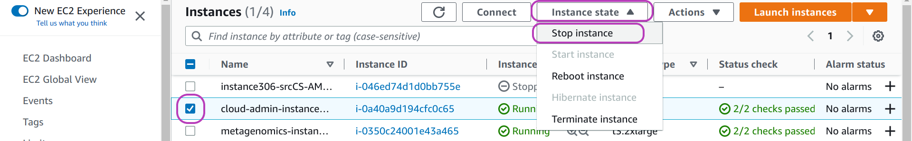
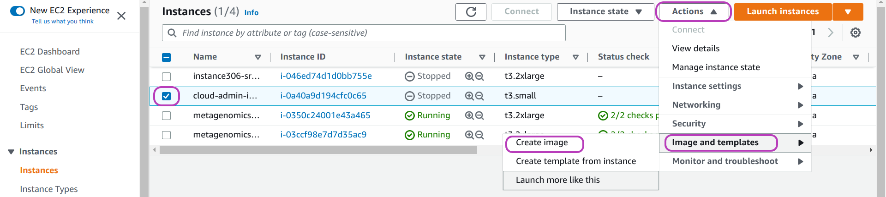
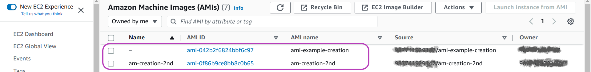
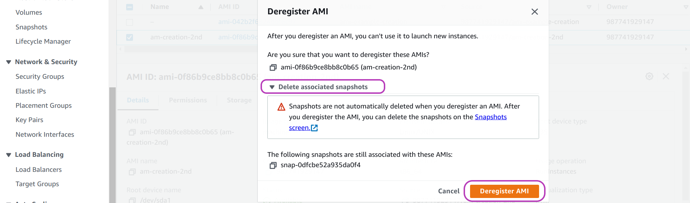
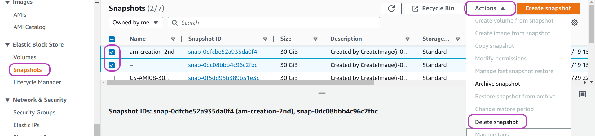
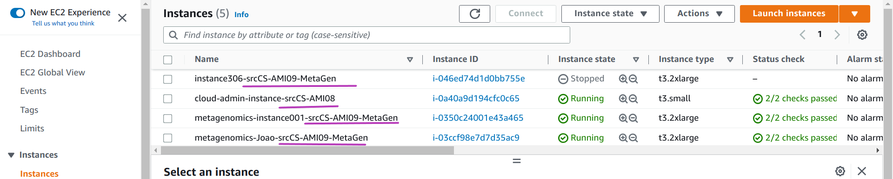

> ## Prerequisites
> To complete this episode you need to have covered **hands-on** the previous episode: [Instances Management Tasks Using the Scripts](../02-instances-management-tasks/).
{: .prereq}

# Introduction

An AWS instance is a virtual machine that runs on AWS **physical servers**. An AWS instance is created by combining two main components: (1) a **software environment**, typically an operating system such as Windows, Linux or MacOS, configured with end-user software applications and data;  and (2) a **virtualised** (software-emulated) **hardware platform** that is mainly defined by the number of processors and the amount of main memory to be made available to the operating system.

A software enviroment is called an **Amazon Machine Image** (AMI) in AWS terminology, and there is plenty of AMIs to choose from, offered by AWS itelf, by the AWS Marketplace, or by other AWS users in support of a **community** such as the Carpentries or the Cloud-SPAN teams. Some AMIs are configured as database servers, others as web servers, etc., either with Windows, Linux or MacOS. **Virtualising** hardware platforms enables AWS to run multiple instances on any physical server with enough capacity --- this improves the use of physical resources and the prices users are offered, and users can relatively easily change "hardware platform" on account of computing demand, among other benefits.

In the last episode we used the Scripts to create multiple AWS instances through **specifying** (in configuration files) the **instances names** and **the AMI** from which to create the instances. For each request we make to create an instance, **AWS makes** a copy of the AMI software enviroment, **attaches** the copy to a "hardware platform" (we specified *t3.small*), and **configures** the copy which then becomes a proper runnable and accessible instance. The AWS configuration of each instance/copy includes, among other things, injecting the counterpart of the login key we created for the instance so that the **ubuntu** user can login. Finally, each instance is configured (by our script `aws_instances_configure.sh`) by login with `ssh` to the **ubuntu** account to enable the **csuser** account.

**AMIs are created from AWS instances** in three main steps: (**1**) **creating** an instance, (**2**)  **configuring** the instance as *required* regarding software and data, and (**3**) **requesting** AWS *to create* an AMI from the instance --- AWS copies the instance *software environment* into an AMI *software enviroment* from which other instances can be created. Steps 1 and 3 are the same for any AMI and hence are **mechanical**. Step 2, **configuring** an instance to-become-AMI, may be simple or rather complex depending on what software/data needs updating, and may involve design.

This episode presents the management of AMIs that we do as part of managing AWS instances with the Scripts. The first 3 sections cover the **mechanical part** hands-on, steps 1 and 3 above, which are rather simple once you have gone through the tasks involved. The subsequent sections cover our approach to and experience in **configuring** instances to-become-AMIs. You won't be doing any such configuring. However, knowing the configuring we have done and some scripts we developed to facilitate common configuring tasks will help you not to start from scratch.

> ## Sections
> 1. **[Create an Instance to-become-AMI](#1-create-an-instance-to-become-ami).**\
  In this section you are going to create an instance to-become-AMI using the file-directory structure we use to manage such instances. 
>
> 2. **[Create an AMI and Make It Public in the AWS Console](#2-create-an-ami-and-make-it-public-in-the-aws-console).**
>
> 3. **[Delete an AMI in the AWS Console](#3-delete-an-ami-in-the-aws-console).**\
  We use the AWS Console to create an AMI, to make it public or private, and to delete it. Sections 2 and 3 will guide you perform those tasks with the AWS Console as we do --- in case you are wondering about **scripting AMIs management**, yes AMIs can also be managed (created, deleted, etc.) with the AWS CLI, and hence a set of scripts (like the Scripts that manage instances) could be developed to manage AMIs. We haven't had the need to do so, however: the AMI tasks we need to perform are rather easy in the AWS Console and only rarely needed in the Cloud-SPAN project, so far.
> 
> 4. **[Instances Management for Courses, AMIs and Tests](#4-instances-management-for-courses-amis-and-tests)**.\
> Section 1 introduces the file-directory structure we use to manage instancest to-become-AMIs. This section describes other AMI management practices we follow.
> 
> 5. **[When and How to "Create an AMI": Configure an Instance to-become-AMI](#5-when-and-how-to-create-an-ami-configure-an-instance-to-become-ami)**.\
> Based on our experience in configuring instances to-become-AMIs within the Cloud-SPAN project, this section presents our viewpoint as to when and how to create an AMI.
{: .callout}

# 1. Create an Instance to-become-AMI
This section shows you how to create an instance to-become-AMI using the file-directory structure that we use to manage such instances. 

The structure is similar to the one we use to manage **courses**, that is: we use a directory called **ami-instance-configs** that contains a directory for each AMI we create, and inside each such directory the `inputs` directory with the Scripts configuration files to create and manage an instance to-become-AMI. And we handle our **courses** and **ami-instance-configs** directories at the same level:

~~~
ami-instance-configs            
   ami01-theScripts-course      ### course/workshop name; you can use other name
      inputs                    ### you **cannot** use other name
         instancesNames.txt     ### you can use other name 
         resourcesIDs.txt       ### you **cannot** use other name
         tags.txt               ### you **cannot** use other name
      outputs                   ### created automatically by the Scripts - not to be changed
   ami02-genomics-course
   ami03-metagenomics-course   
courses       
   genomics01 
   genomics02 
   metagenomics01
~~~
{: .output}

Let's create the directory-file structure you need to create the instance to-become-AMI. Type or copy-paste the commands in the code box below. For convenience, our full prompt (`csuser@cloud-admin-instance:~`) is only shown for the first command.

~~~
csuser@cloud-admin-instance:~
$ mkdir -p ami-instance-configs/ami01-theScripts-course/inputs
$ cp courses/instances-management/inputs/* ami-instance-configs/ami01-theScripts-course/inputs/
$ ls ami-instance-configs/ami01-theScripts-course/inputs/
instancesNames.txt  resourcesIDs.txt  tags.txt
~~~
{: .bash}

You now need to edit the file **instancesNames.txt** with your text editor to:
- delete all the instances names
- enter a new single instance name\
  for example: *instance-to-become-AMI01-noConf* --- long but useful in the AWS Console when you have many instances
- save the file

Then create the instance:
~~~
csuser@cloud-admin-instance:~
$ csinstances_create.sh ami-instance-configs/ami01-theScripts-course/inputs/instancesNames.txt 
~~~
{: .bash}

The instance should now be running. 

# 2. Create an AMI and Make It Public in the AWS Console
This section shows you how to use the AWS Console to create an AMI from the instance you created above and how to make the AMI public (usable by other AWS users).

As mentioned in the introduction, you will normally create an AMI in the AWS Console after you have both created and **configured** an AWS instance from which to create the AMI. We are **skipping** the configuration step. You are not compelled to configure an instance before creating an AMI from it. You can create an AMI any time you see it necessary/useful, including learning how to do it.

> ## You can create an AMI any time you deemed necessary/useful.
> This is rather useful when the configuration of an instance to-become-AMI is long, .., complex. You can create various intermediate AMIs at different levels of progress and roll back to any of them if needed --- kind of managing multiple **commits** with `git`. If you need to roll back to an intermediate AMI, say, AMI02, you will create an AWS instance from AMI02 and that instance will become your new instance to-become-AMI. 
{: .callout}

**Login to** the AWS Console with your IAM account user. Then **go to** the page "EC2 - Instances":
  - type **EC2** in the AWS search box at the top.
  - in the page that appears, "EC2 Dashboard" (not shown), click on **Instances** on the left menu pane.

You should now be presented with the "Instances" page, similar to the page below. 

## Stop the instance if it is running
Creating an AMI involves **making a copy** of the source **instance** *software environment* (operating system, end-user software applications and data). In order to ensure the **consistency** of the copy, we need to stop the instance before the copy starts.

On your  "Instances" page:
- select your instance to-become-AMI if it is running: **check** the box to the left of the instance name.\
  we have selected "cloud-admin-instance" in the page below.
- click on the drop-down menu **Instance state** at the top.
- click on **Stop instance**.
- wait for the instance state to change to **Stopped**.

{: width="900px"}

> ## You may need to **reboot** the instance first, and then **stop** it.
> You may have already seen a message like the one below after updating the operating system in your personal computer:
> 
>  "*Your computer needs to restart for changes to take effect.*"
>
> If you have updated the operating system in the instance to-become-AMI as part of the configuration you intend for the new AMI, then **you need to reboot the instance** first and then stop it before creating an AMI from it. If **you don't**, if you create the AMI without rebooting the instance, then each of the instances that you create with that AMI will have to be rebooted after being launched. Hence you just delay doing it and will have it multiplied.
>
> We always reboot an instance to-become-AMI even if we only update end-user software applications or data so that any state or data is flushed from main memory onto secondary storage (which is the software environment to copy).  The page above shows the option to **Reboot** an instance.
{: .callout}

## Select the instance and the options to create an image from it
Once your instance is stopped, do as follows (see page below): 
- select your instance if it is not selected: **check** the box to the left of the instance name.
- click on the drop-down menu **Actions** at the top 
- click on **Image and templates** 
- click on **Create image**.

{: width="900px"}

## Enter a name and other details for the image and click on **Create image**
You will now be presented with the page below: "Create image". Type a **name** and a **description** for your AMI in the first two highlighed fields from the top. The description field is optional; but it's useful to write a brief description of the AMI configuration so you can easily recall what the AMI is about.

The highlighted option below, **No reboot** and its checkbox **Enable**, should be as shown: **unchecked**. Uncheck it if it is checked. By default, AWS **shuts down** and **reboots** the instance to-become-AMI if it is running in order to get a consistent state of the instance storage. If you check it, you **Enable** (both no shut down and) **No reboot**. And AWS **cannot guarantee** a consistent state for the AMI. This option is not applicable if you (reboot and) stop the instance as suggested.

The highlighted option below and to the right, **Delete on termination** and its checkbox **Enable**, should be as shown: **checked**. Check it if it is unchecked. This option means that, for all instances created from the AMI you are about to create, once the instances are **terminated**/deleted, their storage/volumes should be deleted. We want this behaviour --- we don't want to delete each such volume individually: **the Scripts don't handle deleting those volumes**. On the other hand, you may find usefull to delete an instance but not its storage: you will no longer be able to stop, start and login to the instance, but you will be able to attach its storage to another (runnable) instance. We did something along these lines to reduce the size of the disk and file system of an AMI. 

The value of the field **Size**, at the bottom of the page in the middle, is 30 GB, and is the size of the storage of the instance to-become-AMI. The same size will be used for the storage of the AMI to be created unless you increase it. You **cannot decrease** it: it is assumed that the operating system inside is controlling all the storage (even if it is not) --- decreasing it would corrupt the file system.

{: width="900px"}

Scroll down the "Create image" page until you see the end of the page as shown below. The first highlighted option from the top, **Tag image and snaphots together**, should be **checked**. Check if it is unchecked. Now click on  **Add new tag** on the bottom left (we have already done so in the page below) so that two boxes will appear, titled **Key** and **Value** - *optional*. In the Key box, enter **Name** (literally), and in the Value box enter the name you entered for your AMI before, see the page below. The benefit of doing this is explained below. You can add more tags if needed.   

Finally, click on **Create image** at the bottom right. You will be presented with the "Instances" page again, showing at the top a message like this one (our emphasis):

"*Currently creating AMI ami-0f6c9742b2f6824bb from instance i-00c65a40a9d194cfc. Check that the AMI status is 'Available' **before deleting the instance** or carrying out other actions related to this AMI*".

{: width="900px"}

## Check your AMI and make it public or private
To check your AMI, go to the (EC2) "Amazon Machine Images (AMIs)" page: on the left menu pane, scroll down (or up) to find **AMIs** and click on it. 

You will be presented with a page like the one below. The page below shows (in tabular form) the attributes/properties of two AMIs that we created for this section. The attribute **Name** (first column from left), corresponds to the value of the tag key that we suggested to add. The third attribute, **AMI name**, is the name of the first field in the page above where you entered the name for your AMI when your created it. 

You can see in the page below that we didn't add such a tag for the first AMI listed, so it has no value for **Name**, but we did add the tag for the second AMI using the same value for **Name** that we used for **AMI name**. The benefit of this tagging will be apparent when we delete the AMI below.

{: width="900px"}

In the AMIs page shown above, there are quite a few more attributes for each AMI in that table on the right (scroll the table left to see other AMI attributes, there is a bar below the table to do so, not shown in the page). Other AMI attributes include:
- **Visibility** 
- **Platform** (Linux, Windows, etc.)
- **Creation date**
- etc.

Visibility is about whether an AMI is **private** or **public**. If you create an AMI you can keep it private for your own exclusive use or make it public so that other people (outside your AWS account) can find it and use it to create instances from it. Public visibility extends to the region where the AMI is created only.

To make an AMI public or private, do as follows in the AMIs page:
{: width="900px"}

- select the AMI: check the box to the left of the AMI Name 
- click on the drop-down menu **Actions** at the top right
- click on **Edit AMI permissions** --- in the page that appears, "Edit AMI permissions" (not shown):
  - select **Public** or **Private** under the heading "AMI Availability", then scroll down and
  - click on **Save changes**  

# 3. Delete an AMI in the AWS Console
Deleting an AMI is a two-fold task: **deleting the AMI** as such and **deleting its storage** --- similar to deleting an instance but keeping its storage mentioned above. But there is no option  in the AWS console for AMIs (as there is for instances) that you can check (turn on) so that  deleting an AMI will involve deleting its storage as well. You need to delete the AMI first and then delete its storage.  We believe **one reason** for this is to give you a second chance **to recover an AMI** in case you delete it by mistake. 

## Delete the AMI first

To delete an AMI, do as follows in the (EC2) AMIs page (see page below):

- select the AMI: **check** the box to the left of the AMI Name 
- click on the drop-down menu **Actions** at the top right
- click on **Deregister AMI** 

{: width="900px"}

Once you click on **Deregister**, a window like the one below will pop up.

{: width="900px"}

In the page above, we have clicked on **Deleted associated snapshots** (in the middle). Doing so displayed the message:

"*Snapshots are not automatically deleted when you deregister and AMI. **After** you deregister the AMI, you can delete the snapshots in the **Snapshots Screen**[link].*"

As the message states: you can delete the storage/**snapshots** of an AMI only **after** you delete/**deregister** the AMI.  You have two options to do so. We will describe first the option we have been using.

In the option we use, in the popped up window in the page above:

- click on **Deregister AMI** (in orange) to confirm deletion of the AMI:\
  the AMIs page will be displayed again with the message "Successfully deregistered ami-042b2f6824bbf6c97." in green at the top.

Once you click on **Deregister AMI**, the AMI as such will be deleted (you won't be able to create instances from it). You now need to delete the snapshots.

## Delete the storage/snapshots of the AMI (option we use)

To delete the snapshots of an AMI, go to the (EC2) "Snapshots" page: on the **left** menu pane, scroll down (or up) to find **Snapshots** and click on it. You will then be presented with a page like the one below. 

Do as follows in this page:
- select the snapshot/s to delete: **check** the box to the left of the snapshot Name.
- click on the drop-down menu **Actions** at the top right
- click on **Delete**

{: width="900px"}

That's it. You have deleted the AMI in its entirety.

In this option to delete the snapshots of an AMI, note that we rely on the tagging we suggested to add in the instructions to create an AMI. That is:
- selecting the option **Tag image and snapshots together** and
- adding a Tag with the *Key* **Name** and *Value* ***your-AMI-name***

In the page above, the snapshot with no **Name** (the second one of those checked) is the snapshot attached to the AMI for which we did not specify that tag. With no such tags, you will need to somehow ensure that you are deleting the right snapshot, by looking at the details of the target AMI to get the IDs of the attached snapshots. 

## Delete the storage/snapshots of the AMI (other option)

Alternatively, you can delete the snaphots of an AMI as follows. In the page with the window that pops up after you clicked on **Deregister AMI** for the first time (shown below again), do as follows:
- click on **Snapshots screen** (in blue) **before** clicking on **Deregister AMI**.\
  This will open the "Snapshots" page in a new browser tab, **listing only** the snapshots attached to the AMI/s you previously selected to deregister --- hence you don't need the **Names** of the relevant AMI to identify the snapshots.
- click on **Deregister AMI**  --- you need to deregister the AMI before deleting the snapshots.
- in the "Snapshots" page in the new browser tab
  - select the snapshots to delete 
  - click on **Actions** at the top of the page
  - click on **Delete snaphot**

{: width="900px"}

# 4. Instances Management for Courses, AMIs and Tests
Section 1 introduced the file-directory structure we use to manage instances **for courses** and **for AMIs** (instances to-become-AMIs). 

We also handle instances **for tests** similary, that is: using a directory called **tests** that contains a directory for each test we perform, and inside each such directory the `inputs` directory with the Scripts configuration files to create and manage the instance/s used in the test. A test may involve trying a new domain name configuration, trying the configurability of intance types `t2.small` vs `t3.small`, etc. The results of a test may or may not be incorporated into an AMI.

## Our working directory to run the Scripts
The **tests** directory is located at the same level as the directories **courses** and **ami-instance-configs**. Our actual working directory where we run the Scripts (in our Linux machine) looks like this:

~~~
jorge@wine:~/software/york/cloud-SPAN/aws-instances
$ ls
~~~
{: .bash}
~~~
ami-instance-configs  courses  tests  the-Scripts
~~~
{: .output}

And we run the Scripts specifying:
1. either `ami-instance-configs` or `courses` or `tests`.
2. one or more **intermediate** directories (before the `inputs` directory where the configuration files *instancesNames.txt*, `resourcesIDs.txt` and `tags.txt` reside).
3. the `inputs` directory.
4. the target *instancesNames.txt* file.

Examples: 
~~~
jorge@wine:~/software/york/cloud-SPAN/aws-instances
$ csinstances_create.sh ami-instance-configs/ami09-metagenomics-instance/metagenomicsT3instance/inputs/instancesNames01.txt 
$ csinstances_create.sh courses/genomics20221206-7/inputs/instancesNames.txt
$ csinstances_create.sh tests/t003-cloud-admin-course-instance-UoYacc20221107/inputs/instancesNames-cloud-admin-instance.txt
~~~
{: .bash}

The file-directory structure is rather flexible. We are only bound to specify first (the type of the target instances through the name of the directory)  `ami-instance-configs` or `courses` or `tests` and down the path the `inputs` directory just before the target *instancesNames.txt* whose name we can choose accoding to need. 

The path in the first example has two **intermediate** directories while the two other examples have only one (as in all the code examples we showed before). In the **first example**, we started the configuration of the meteganomics instance to-become-AMI using the AWS instance type `t2.medium` which we inherited from the Data Carpentries AMI. Instance type `t2` cannot scale as much as we needed to, while instance type `t3` can. So we changed to `t3` which involve creating a new temporary AMI and we decided to handle it on a new intermediate directory called `metagenomicsT3instance` under `ami09-metagenomics-instance`. We could also have handled it as `ami09-metagenomics-T3instance` under **ami-instance-configs**.

## Instances names we use
The actual names we use when creating instances are suffixed with the name of the AMI template from which the instances are created. You don't need to follow this naming convention but it may be helpful under some circumstances.

It was helpful for us in the beginning, when we had to add some functionality/configuration into a new AMI relatively frequently until our AMIs got "stable" --- meanwhile we had instances running that were created from different AMI templates. Anyway, we needed displayed in the AWS Console the name of the source AMI of each instance. So instances names in our *instancesNames.txt* files have this form:
~~~
instance306-srcCS-AMI09-MetaGen
cloud-admin-instance-srcCS-AMI08
metagenomics-instance001-srcCS-AMI09-MetaGen
metagenomics-Joao-srcCS-AMI09-MetaGen
~~~
{: .output}

The instance name proper, the one that is used for the instance domain name and hostname of each instance, is the substring from the beginning of each line up to before the substring `-src` (for source AMI name). After `src` you can add the name of your AMI. The scripts extract the instance proper name to configure the instance domain name and host name within each instance. But use the whole name as the value for the instance tag **Name** which is displayed in the AWS Console, as shown below:

{: width="900px"}

We can handle the name of the source AMI as part of the instance name but then it will appear in both the instance domain name and the host domain name and this would be distracting to  end users. 

As **mentioned above**, you don't need to suffix your instances names but obviously **you should not use** the substring `-src` anywhere in an instance name unless you do add the source AMI name. You can also edit the Scripts to get rid of that suffix handling.

The list of instances names in the output box above is **not** meant to be an actual "instancesNames.txt" file that can be used to create/manage instances with the Scripts. The Scripts cannot create instances using two or more AMI templates --- but only one. 

> ## Exercise: How would you handle a Code Retreat that requires instances from two or more AMI templates?
> We currently manage two AMIs, one for the Cloud-SPAN courses Prenomics and Genomics and the other for the Metagenomics course. When we run each course we only need to create instances from one AMI template. But we also run Code Retreats in person with students of the three courses and we launch instances of type Genomics and Metagenomics.
>
How would you manage the instances for such a code retreat within the **courses** directory?
{: .callout}

# 5. When and How to "Create an AMI": Configure an Instance to-become-AMI
This section presents some of our experince in **configuring** instances to-become-AMIs --- the second step of the three main steps to create an AMI mentioned earlier:
1. creating an instance (Section 1)
2. configuring the instance as required regarding software and data, and 
3. requesting AWS to create an AMI from the instance (Section 2)

We use in this section the term "*creating an AMI*" to mean **both** "*configuring an instance to-become-AMI*" **and** "*creating an AMI from that instance in the AWS Console*". 

## Requirements for which we have created a new AMI
- updating software or data
- reducing the storage size
- increasing the storage size
- changing AWS configuration

## Updating software or data
Updating software or data or both is the obvious reason to create a new AMI --- it literally means any change in software or data, including: 
- updating or upgrading the operating system
- updating any other software: 
  - end user software applications to be used in a course
  - admin software (scripts) that **you** (as instances manager) need installed, for example, the Scripts that activate the **csuser** account in each instance, as outlined in the previous episode.
- updating data for a course

It is not convenient and we find it unmanageable to create a new AMI every time any item in that list changes. The items that do **require creating** a new AMI **straight away** are **updating data** for a course and sometimes **updating admin scripts** that you need installed in each instance (to be created from the AMI). In our experience all other items can wait, should be assessed, and when possible combined into a new AMI.

### Updating data
Updating data requires a new AMI because the data to be updated/added is the subject of (will be processed and analysed in) a course, or you may need to delete some data because it is too big, no longer needed, and you need space in the AMI for something else. 

But, would it not be better to have each instance (created from the currently used AMI) update the data using some scripts?  And thus avoid creating a new AMI.

If the data is relatively big, it is much better to update the data only once, in the new AMI, rather than mutilple times in each of the  instances because the entire process of creating and preparing the instances will take much longer. Also, the script/s to update the data may be complex and **ad hoc** for each data update, at least in the beginning ---  until you identify some pattern that enables you to configure the script/s and data transfers in a generic way.

If the data is relatively small, the script/s point just mentioned applies. It will be more complex to design the script/s to update data in each instance than just updating the data in the AMI only once. 

If you decide to design new script/s to update data in multiple instances (as opposed to creating a new AMI), you should not invoke the new script/s within the Scripts. Run the Scripts first to create the instances, and then run the new scripts to update data.  

### Updating admin scripts
Updating admin scripts that you need installed may, or may not, require creating a new AMI straight away. 

#### *Scenario that **required** creating a new AMI straight away*
The first AMI we created was a copy of the Data Carpentries AMI. Instances created from this AMI are also accessed with `ssh` but using an IP address and a password for the `csuser`, which password is the same for all instances. For the Cloud-SPAN instances, we decided to use domain names (instead of IP addresses) and no password for the `csuser` but an encrypted login key file for each instance. This required, among other things, to create and upload into the first Cloud-SPAN AMI a few scripts into the `ubuntu` user account, in the `~/bin` directory. This scripts make the `ubuntu` user share the counterpart login keys, injected by AWS, with the `csuser`, so that both users can use the same loging key file created for each instance. Each instances created from the first Cloud-SPAN AMI has those scripts which are invoked by the  script `aws_instances_configure.sh` as part of the configuring of each instance.

> ## You can only use the Scripts with Cloud-SPAN AMIs:
> Because of that "login key" and "domain name" **configuration** to access instances, the Scripts can only be used with a Cloud-SPAN AMI as the template from which to create instances.\
  If you want to use Scripts and that configuration is OK with you, you can still create your own AMI by configuring the end user software applications and data.\
  If you want to use the Scripts **but change** that configuration (for example, you want to use IP addresses or not using login key for the csuser, etc.), you will need to change both the AMI configuration and change the script `aws_instances_configure.sh` accordingly.
{: .callout}

#### *Scenario that **did not require** creating a new AMI straight away*

The instances for the Cloud-SPAN Metagenomics course have each 240GB of secondary storage. The *input* data that is analysed during the course is about 17GB, but the output data produced from various analyses grows over 100GB. Before the analyses, the input data, the operating system and the metagenomics software applications require less than 50 GB. 

Hence we could have created an AMI of about 50GB and, on creating each instance for the course, **increase** the storage size of each instance to 240GB as part of, or after, the configuration step of each instance. Instead we created the Metagenomics AMI of size 240GB.

The main reason for that decision was that we ran out of time to design and test the scripts to increase storage. It was safer to have the AMI with 240GB ready and hence the instances also ready once created. 

### Updating the operating system end user software applications

We have only upgraded the Linux operating system only once. The Data Carpentries AMI from which we created the first Cloud-SPAN AMI was Linux Ubuntu 16:04. The Cloud-SPAN Genomics and Metagenomics AMIs are version 20.04. We don't see the need to upgrade them to the stable version 22.04 yet. Upgrading them will most likely involve udpating the user software applications installed in each AMI.

Likewise we have only updated the user software applications in each AMI only once, when we  upgraded the Linux operating system from the Data Carpentries version. We don't see the need to update them again. **There is no need** unless changes to the Genomics/Metagenomics course to be delivered justify updating the software applications, something like: somebody has used a more recent version of a software application and has changed the course materials with more accurate results or another way of using the application, etc. 

Whenever possible, install end user software applications locally in the `csuser` `~/bin` directory or other local directory.  You will have more control as to what to delete in order to create a new AMI. 

## Reducing storage size
Reducing storage size **is complex**, and we cannot see a way to automate it yet.  We have done it a few times and hopefully won't have to do it again in the context of the Cloud-SPAN project --- you may not either.

We decided to reduce the size of the Cloud-SPAN AMI for the Prenomics and Genomics courses for two reasons. Those courses don't require instances bigger than 30GB and 30GB is the instance size limit in the AWS Free Tier. Thus, Cloud-SPAN students can create their own Genomics instance without paying for one year as described in the Cloud-SPAN course [Create Your Own AWS Instance](https://cloud-span.github.io/create-aws-instance-0-overview/).

As mentioned earlier, the first AMI we created was a copy of the Data Carpentries AMI, which was 120GB. We reduced it to 30GB following the instructions in [How To Shrink Amazon EBS Volumes (Root Or Non-Root)](https://ehikioya.com/shrink-amazon-ebs-volumes/).

We followed those instructions for storage volumes called `/dev/xvda` and `/dev/xvda1` which are used in instances of type `t2`. Cloud-SPAN AMIs are now type `t3` whose storage volumes are called `/dev/nvme0n1 1` and `/dev/nvme0n1p1`. 

Hopefully you won't need to reduce storage below 30GB. 

## Increasing storage size
Increasing storage size is rather simple and efficient in AWS. 

We had to increase storage size for the Cloud-SPAN Metagenomics course instances, up to 240GB, for the reasons already mentioned above. Starting with the Cloud-SPAN AMI for the Genomics course (30GB), we created an instance into which we uploaded a script (into the `ubuntu` account `~/bin` directory) that increases storage size, and then created a new AMI. All the instances created from this AMI can run that script to increase the storage size dynamically: without having to log out from the instance. The script is called `aws_storageEBS_increase.sh`. Below is its output when you run it in an instance as the `ubuntu` user without parameters:

~~~
ubuntu@cloud-admin-instance.cloud-span.aws.york.ac.uk:~ $ aws_storageEBS_increase.sh 
~~~
{: .bash}

~~~
aws_storageEBS_increase.sh increases the size of the instance disk (EBS storage and the file system)
up to the given number of GigaBytes (GB) if such number is larger than the current size of the disk.
 
usage: 
  aws_storageEBS_increase.sh newSizeOfDiskInGBs

Example:       aws_storageEBS_increase.sh 120 
 
  - increases the size of the disk and file system to be of 120 GB. 
  - the current disk size must be smaller than 120 GB
  - note that the file system size may be shown as slightly smaller than disk space:
    try command: "df -h ."
~~~
{: .output}

Following the development of the Cloud-SPAN Metagenomics AMI, after we created the AMI with the script `aws_storageEBS_increase.sh` inside, we created an instance, logged into the instance, ran that script to increase the size up to 240GB, and then created the Metagenomics AMI. 

> ## Exercise: How would you increase the size of Metagenomics instances dynamically?
> That means, how would you?:
> - create Metagenomics instances using an AMI 50GB big, and then
> - increase the size of each instance to 240GB running the script `aws_storageEBS_increase.sh` in each instance once the instance is created.
{: .callout}

### You will hopefully only need to increase storage size (and not decrease it)
The size of the Cloud-SPAN Genomics AMI and instances is 30GB. Small enough to be in the AWS Free Tier. Hopefully you will only need to increase its size as outlined above and not to decrease it.

That is, should you need to create a new AMI, you should start with the Cloud-SPAN Genomics AMI, the one you used to create instances with the Scripts in the previous episode.

## Changing AWS configuration

The Cloud-SPAN Metagenomics AMI not only required more storage than the Genomics AMI but also **more main memory and more processors** which, you will remember, are aspects of the (virtualised) "hardware platform" (not of the software enviroment wich comprises the storage).

We were using "hardware platforms" of type `t2` (following the Data Carpentries use): `t2.small`, `t2.medium` `t2.large`, etc. For the Metagenomics AMi, at some point we needed to use a larger instance type, `r5.4xlarge`, but we couldn't. We got a message saying that type `t2` was incompatible with the type of internet access required by type `r5.4xlarge`, something called Elastic Network Adapter (ENA).

Type `t3` instances are ENA compatible, have similar sizes to type `t2` (small, medium, etc.), and can use type `r5.4xlarge` and others.  So we change to type `t3`, meaning that the Cloud-SPAN Genomics and Metagenomics AMIs are type `t3` and hence, instances created from them are type `t3` as well.

You can create `t2` instances from a `t3` AMI, as follows: in the `resourcesIDs.txt` file you would use `t2.small` (or other `t2` type) as the instance type but use a type `t3` AMI template such as the Cloud-SPAN AMI you used in the previous episode. The opposite doesn't hold: you cannot create `t3` instances from a `t2` AMI --- you will be able to create instances but **you won't be able to login**. 

Again: should you need to create a new AMI, you should start with the Cloud-SPAN Genomics AMI, the one you used to create instances with the Scripts in the previous episode. It will enable you to increase the storage size of offspring instances dynamically, and being `t3` type you can run offsping instances on more instance types. 

By the way, you can change the instance type of an instance in the AWS Console as follows. Go to the **EC2 - Instances** page and select the instance, check the **checkbox** to the left of the instance name, then:
- stop the instance: click on **Instance state** at the top and then on **Stop instance**
- wait for the instance state to change to **Stopped**
- change the instance type: click on **Actions** at the top, then on **Instance settings**, and then on **Change instance type**. A new page will appear where you will be able to change the instance type --- save the changes
- restart the instance. 

## Other scripts that maight help you create AMIs
When you downloaded the Scripts that create and manage instances, you also you downloaded other scripts that we regularly use to create AMIs (configure instances to-become-AMIs), namely:

- `cpfromInstance.sh`
- `cptoInstance.sh`
- `metagenomics_sftw_install_csuser2v.sh`
- `metagenomics_sftw_install_ubuntu2v.sh`

The scripts `cpfromInstance.sh` and `cptoInstance.sh` copy a file or a directory **from** an intance onto your Linux environment, and **to** an instance from your Linux environment, respectively. You run both scripts **in** your Linux environment. We developed these scripts because at some point, in configuring AMIs we needed to copy directories with files that contained links to other files within the directories, and `scp` does not copy links but copy the files the links point to. Our scripts use `rsync` instead of `scp` to handle such situations.

The scripts `metagenomics_sftw_install_csuser2v.sh` and `metagenomics_sftw_install_ubuntu2v.sh` were used to automate somewhat the installation of end user software applications for the Cloud-SPAN Metagenomics AMI. Such installation required to update (not upgrade) the Linux operating system and install a few applications at system level. The script `metagenomics..ubuntu2v.sh` does that. The script `metagenomics..csuser2v.sh` installs other end user software applications locally in the `csuser` account. These scripts are installed in the Metagenomics AMI and should be run in an instance you create from that AMI to create a new AMI. Once the instance is created, you would login to the `ubuntu` account and run the script `metagenomics..ubuntu2v.sh` and follow the instructions. You would then login to the `csuser` account and run `metagenomics..csuser2v.sh` and follow the instructions. These scripts were really useful to handle the complexity of configuring the Metagenomics AMI. They not only automated tedious tasks but also documented our work. We will develop similar scripts for updating the Genomics AMI in case we update it again.

The code boxes below will give you an idea of what the four scripts do and how to run them:

Running **`cpfromInstance.sh`** with no parameters:
~~~
jorge@wine:~/software/york/cloud-SPAN/aws-instances
$ cpfromInstance.sh 
~~~
{: .bash}
~~~
cpfromInstance.sh copies a file/directory from csuser account in an AWS instance to the local machine.
 
usage: 
 
  cpfromInstance.sh [-u][-v] login-key-instanceName.pem  remoteFileOrDirName  [localFileOrDirName]
 
- NB: copying an individual file or directory overwrites the local ones if they exist; rsync is
  used to copy directories so that links are included.
- use -u to copy from the 'ubuntu' account instead (of the 'csuser' account).
- use -v (verbose) to see what's going on and the copy command used.
- login-key-instanceName.pem is the name (path) of the file containing the RSA login key to access
  the instance. The name of the instance to copy to is extracted from this name.
- if localFileDirName is not specified, the copy will be named as the remoteFileDirName and copied to the
  local current directory.
- Examples:
  cpfromInstance.sh gc_data/outputs/login-keys/login-key-instance017.pem  shell_data
  - copies (file/dir) instance017.cloud-span.aws.york.ac.uk:/home/csuser/shell_data to ./shell_data
 
  cpfromInstance.sh -u gc_data/outputs/login-keys/login-key-instance017.pem  shell_data  shell_data2
  - copies instance017.cloud-span.aws.york.ac.uk:/home/ubuntu/shell_data  to  ./shell_data2
~~~
{: .output}

Running **`cptoInstance.sh`** with no parameters:
~~~
jorge@wine:~/software/york/cloud-SPAN/aws-instances
$ cptoInstance.sh 
~~~
{: .bash}
~~~
cptoInstance.sh copies a local file/directory to the csuser account of an AWS instance.
 
usage: 
 
  cptoInstance.sh [-l][-u][-v] login-key-instanceName.pem  localFile/DirName  [remoteFile/DirName]
 
- NB: copying an individual file or link overwrites remote ones if they exist; remote directories are
  not overwritten if they exist but the copy is suffixed thus: remoteDirName-CopyYYYYMMDD.HHMMSS.
- use -l to copy links within directories as links (otherwise files pointed to by links are copied).
- use -u to copy to the 'ubuntu' account instead (of the 'csuser' account).
- use -v (verbose) to see what's going on and the copy command used.
- login-key-instanceName.pem is the name (path) of the file containing the RSA login key to access
  the instance. The name of the instance to copy to is extracted from this name.
- if remoteFile/DirName is not specified, the copy will be named as the localFile/DirName and copied
  at the home directory in the instance.
- Examples:
  cptoInstance.sh gc_data/outputs/login-keys/login-key-instance017.pem  data/shell_data
  - copies (file/dir) data/shell_data to instance017.cloud-span.aws.york.ac.uk:/home/csuser/shell_data 
 
  cptoInstance.sh -u gc_data/outputs/login-keys/login-key-instance017.pem  shell_data  shell_data2
  - copies  data/shell_data to instance017.cloud-span.aws.york.ac.uk:/home/ubuntu/shell_data2
 ~~~
{: .output}

Running **`metagenomics_sftw_install_ubuntu2v.sh`**:
~~~
ubuntu@metagenomics-instance001.cloud-span.aws.york.ac.uk:~ $ metagenomics_sftw_install_ubuntu2v.sh 
~~~
{: .bash}
~~~
System is about to be upgraded and configured for csuser to install metagenomics software.
This script and the software install by csuser is prior to creating the metagenomics AMI.
*** NB: the aws cli must have been configured already - cancel installation if not.
*** NB: you must have increased the size of storage with aws_storageEBS_increase.sh.
Do you want to continue (y/n)?: n
Script cancelled (n).
~~~
{: .output}

Running **`metagenomics_sftw_install_csuser2v.sh`**:
~~~
(base) csuser@metagenomics-instance001:~ $ metagenomics_sftw_install_csuser2v.sh 
~~~
{: .bash}
~~~
metagenomics_sftw_install_csuser2v.sh installs all metagenomics software (24 applications): seqkit, .., prokka.
 
usage: 
 
  metagenomics_sftw_install_csuser2v.sh [versions][go]
 
- use option go to install all applications.
- use option versions to see the versions installed.
~~~
{: .output}
